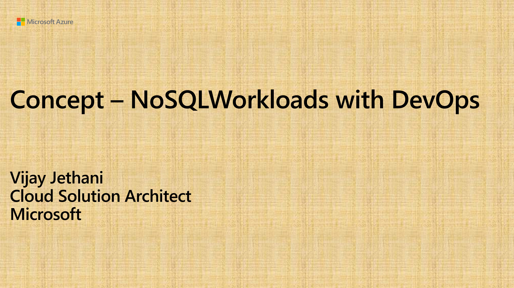

# Welcome to Self Learn Website for DevOps !

- This website is created with Intent to Learn DevOps with guided videos. 
- Start with Concept videos for DevOps for Begineers if you are new to DevOps
- There is Concept video for every workloads before doing Hands on Lab to set Right Basics
- Building upon Concept , there are subscequent vidoes for Hands on Lab which you can Do IT Yourself. 
- These Videos are also available at [DevOps Self Learn YouTube Channel](https://www.youtube.com/channel/UCWmVYgbW-KZbIFCMJTR-gxg)
- Content is latest and and will be updated as and when there is technical refresh about that workload
- DevOps tools used for Automation are Azure DevOps and Github 

## *1. DevOps Concepts for Beginners !*

### Agenda
- Why DevOps
- Know Azure DevOps and Github Tools
- Know how we deal with security
- Know where DevOps will not be effective

## *2. Learn Azure DevOps Repos and Azure Pipeline with Demo !*

### Agenda
- Know Azure Repos
- Create your Own Azure Repos
- Know Azure Pipelines
- Create your Own Azure Pipelines
- Demo Showing Azure Repos and Pipelines in Action

## *3. Learn Github Concepts - Github Repos and Actions with Demo !*

### Agenda
- Know Github
- Create your Own Github Repos
- Know Github Actions
- Create your Own Github Actions workflow
- Demo Showing Github Repos and Actions

## *4. Hands on Labs with Github Actions workflows from Scratch !*

       - Prerequiste : Learn Github Concepts - Github Repos and Actions with Demo

### Agenda
- Learn Github Action Worfklow Syntax
- Create your First Github Action Step by Step
- Create your First Github Secret
- Integrate Github Actions with your Azure Subscription
- Automation at its best, create your first service on Azure
- Build and Deploy code on Azure Services

## *5. Concepts- SQL Workloads Deployments With DevOps !*

### Agenda
- Learn Why we need DevOps for Databases
- How DevOps speeds up Deployments and operation issues
- Use of Native Database Management tools
- What makes up Automation Workflows for Database
- Demo

## *6. Hands on Labs SQL Workloads Deployments With DevOps !*

       - Prerequiste : Concepts- SQL Workloads Deployments With DevOps
       
### Agenda
- Github Actions Deployment for MySQL , PostgreSQL and Azure SQL database
- Github Actions End to End Service Implemmentation for App with SQL Workloads
- Azure DevOps Deployment of MySQL , PostgreSQL and Azure SQL database
- Azure DevOps End to End Service Implemmentation for App with SQL Workloads

## *7. Concepts- NoSQL Workloads Deployments With DevOps !*

### Agenda
- Learn Why we need DevOps for Databases
- Know NoSQL APIs
- How DevOps speeds up Deployments and operation issues
- Use of Native NoSQL Database Management tools
- What makes up Automation Workflows for NoSQL Databases
- Demo

## *8. Hands on Labs NoSQL Workloads Deployments With Azure DevOps !*

       - Prerequiste : Concepts- NoSQL Workloads Deployments With DevOps
       
### Agenda
- Create NoSQL Deployment Workflow with Azure DevOps 
- Implement NodeJs with CosmosDB use case end to end with Azure DevOps
- ImplementJava with CosmosDB use case end to end with Azure DevOps

## *9. Hands on Labs NoSQL Workloads Deployments With Github Actions !*

       - Prerequiste : Concepts- NoSQL Workloads Deployments With DevOps
       
### Agenda
- Create NoSQL Deployment Workflow with Github Actions 
- Implement NodeJs with CosmosDB use case end to end with Github Actions
- ImplementJava with CosmosDB use case end to end with Github Actions

## *10. Concepts - DevOps for Modern DataWarehouse !*

       
### Agenda
- Role of Modern Datawarehouse Components(MDW) 
- Why we need DevOps for MDW
- MDW Pipeline Architecture
- MDW CI/CD Deployment Architecture

